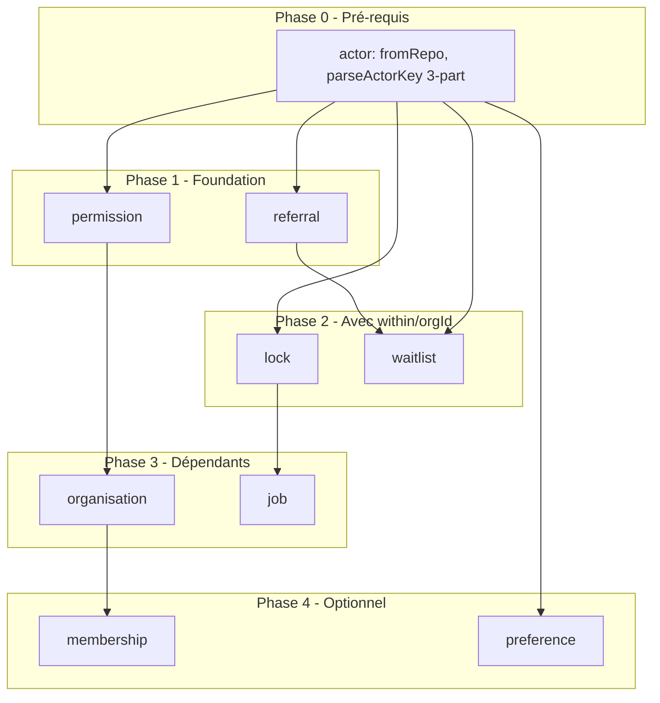

# Plan — Migration @justwant/actor dans l'écosystème

Migration de tous les packages utilisant un concept d'acteur vers `@justwant/actor` comme source canonique.

---

## 1. Inventaire des packages

| Package | Usage actuel | Dépendances |
|---------|--------------|-------------|
| **permission** | Actor, defineActor, IdentityLike (source) | — |
| **waitlist** | Actor { type, id, orgId? }, actorKey interne | — |
| **referral** | Actor { type, id } | — |
| **lock** | LockOwner { type, id, orgId? }, createLockOwner | — |
| **organisation** | defineActor, IdentityLike depuis permission | permission |
| **job** | LockOwner depuis lock | lock |
| **membership** | Member { type, id }, MemberLike | — |
| **preference** | (à implémenter) | — |

---

## 2. Problèmes de compatibilité

### 2.1 Format actorKey

| Package | Format actuel | @justwant/actor |
|---------|---------------|-----------------|
| waitlist | `type:id` ou `type:id:orgId` (3 parts) | `type:id` ou `type:id:withinType:withinId` (4 parts) |

**Stratégie** : `parseActorKey` accepte les deux formats. Format 3-part `type:id:orgId` → interprété comme `within: { type: "org", id }`. `actorKey` produit toujours 4-part quand `within` présent.

### 2.2 orgId vs within

| Package | Champ actuel | Cible |
|---------|---------------|-------|
| waitlist | actorOrgId dans WaitlistEntry | toRepo(actor).actorOrgId quand within.type==="org" |
| lock | ownerOrgId dans Lock, orgId dans LockOwner | LockOwner → Actor avec within |

### 2.3 fromRepo manquant

Les packages qui lisent des entrées (WaitlistEntry, Lock) doivent reconstruire un Actor pour l'API. `@justwant/actor` n'a pas `fromRepo`. À ajouter.

---

## 3. Extensions @justwant/actor (pré-requis)

### 3.1 fromRepo

```ts
/** Repo shape with legacy actorOrgId (waitlist, lock). */
export interface RepoShapeInput {
  actorType: string;
  actorId: string;
  actorOrgId?: string;
  actorWithinType?: string;
  actorWithinId?: string;
}

/** Build Actor from repo shape. Prefers actorWithinType/actorWithinId; falls back to actorOrgId → within: { type: "org", id }. */
export function fromRepo(shape: RepoShapeInput): Actor;
```

### 3.2 parseActorKey — support legacy 3-part

Accepter `type:id:orgId` (3 parts) comme équivalent de `type:id:org:orgId`. Interpréter comme `within: { type: "org", id: parts[2] }`.

---

## 4. Ordre de migration



---

## 5. Détail par package

### 5.1 Phase 0 — @justwant/actor

**Fichiers** : `src/actorKey.ts`, `src/actorKey.spec.ts`

- [ ] Ajouter `fromRepo(shape: RepoShapeInput): Actor`
- [ ] Étendre `parseActorKey` pour accepter 3-part `type:id:orgId` → `within: { type: "org", id }`
- [ ] Exporter `RepoShapeInput` et `fromRepo` dans `index.ts`

---

### 5.2 Phase 1a — permission

**Objectif** : Déléguer à @justwant/actor, garder compatibilité API.

**Changements** :

- [ ] Ajouter `@justwant/actor` en dépendance
- [ ] Remplacer `defineActor` par réexport depuis `@justwant/actor`
- [ ] Remplacer `Actor` par réexport depuis `@justwant/actor` (permission n'a pas orgId/within, donc compatible)
- [ ] Remplacer `IdentityLike` par réexport depuis `@justwant/actor`
- [ ] Supprimer `src/define/actor/defineActor.ts` (ou le faire délégateur)
- [ ] Mettre à jour `src/types/index.ts` — retirer Actor, IdentityLike, réexporter depuis actor
- [ ] Mettre à jour `src/resolve.ts` — utiliser `toRepo` de actor si besoin
- [ ] Tests : vérifier que permission.spec.ts passe

**Compatibilité** : L'API publique de permission reste identique (réexports).

---

### 5.3 Phase 1b — referral

**Objectif** : Utiliser Actor de @justwant/actor.

**Changements** :

- [ ] Ajouter `@justwant/actor` en dépendance (ou peer)
- [ ] Dans `src/types.ts` : retirer `Actor`, réexporter depuis `@justwant/actor`
- [ ] Vérifier que ReferralService, plugins, etc. restent compatibles (Actor { type, id } sans within)
- [ ] Tests : referral.spec.ts, e2e

**Impact** : Aucun breaking — referral n'utilise pas orgId/within.

---

### 5.4 Phase 2a — lock

**Objectif** : LockOwner = Actor. createLockOwner produit Actor avec within.

**Changements** :

- [ ] Ajouter `@justwant/actor` en dépendance
- [ ] Dans `src/types/index.ts` : `LockOwner` = type alias de `Actor` depuis actor
- [ ] Dans `src/define/owner/createLockOwner.ts` : produire `Actor` avec `within: { type: withinType, id: withinId }` au lieu de `orgId`
- [ ] Dans `src/lock/createLock.ts`, `src/semaphore/createSemaphore.ts` : utiliser `toRepo(owner)` pour construire les champs ownerType, ownerId, ownerOrgId (quand within.type==="org")
- [ ] Pour matcher un lock : `ownerMatches` compare via `toRepo` ou via actorKey
- [ ] Exporter `LockOwner` comme alias de `Actor` pour rétrocompat
- [ ] Tests : lock specs

**Compatibilité** : LockOwner reste structurellement identique. Les usagers qui font `createLockOwner({ name: "user", within: "org" })("org_1", "u1")` reçoivent désormais `{ type, id, within: { type: "org", id: "org_1" } }` au lieu de `{ type, id, orgId: "org_1" }`. C'est un **breaking change** pour les usagers qui lisent `owner.orgId`. Migration : `owner.orgId` → `owner.within?.type === "org" ? owner.within.id : undefined`.

---

### 5.5 Phase 2b — waitlist

**Objectif** : Actor depuis @justwant/actor, actorKey et toRepo depuis actor.

**Changements** :

- [ ] Ajouter `@justwant/actor` en dépendance
- [ ] Dans `src/types.ts` : retirer `Actor`, réexporter depuis `@justwant/actor`
- [ ] Dans `src/createWaitlistService.ts` : retirer `actorKey` local, importer depuis `@justwant/actor`
- [ ] Utiliser `toRepo(actor)` pour construire les champs repo (actorType, actorId, actorOrgId)
- [ ] Dans `src/adapters/memory.ts`, `src/adapters/db.ts` : `unsubscribe(listKey, actorKey)` — `actorKey` vient de `@justwant/actor`. Adapter le parse : supporter 4-part et 3-part (legacy)
- [ ] Dans `src/plugins/expiration.ts`, `src/plugins/referral.ts` : utiliser `actorKey` de actor
- [ ] WaitlistEntry : garder `actorType`, `actorId`, `actorOrgId` pour compat DB. `toRepo` fournit `actorOrgId` quand `within.type==="org"`
- [ ] Pour `listSubscribers`, `getPosition`, `pop` : convertir WaitlistEntry → Actor via `fromRepo`
- [ ] Tests : waitlist specs, e2e

**Compatibilité** : Les usagers passent `Actor` (avec ou sans `within`). Format actorKey en base : 4-part pour les nouvelles entrées. `parseActorKey` lit les anciennes (3-part).

---

### 5.6 Phase 3a — organisation

**Objectif** : Suivre permission.

**Changements** :

- [ ] Permission migré → organisation reçoit defineActor, IdentityLike depuis permission (qui réexporte actor)
- [ ] Aucun changement de code si permission réexporte correctement
- [ ] Vérifier `createStandardOrganisationPermission`, `permissions/index.ts`
- [ ] Tests : organisation specs

---

### 5.7 Phase 3b — job

**Objectif** : Suivre lock.

**Changements** :

- [ ] Lock migré → job reçoit LockOwner (= Actor) depuis lock
- [ ] Dans `src/plugins/lock.ts` : `LockOwner` est désormais `Actor`
- [ ] Vérifier que le plugin lock fonctionne
- [ ] Tests : job specs

---

### 5.8 Phase 4a — membership (optionnel)

**Objectif** : Aligner Member sur Actor.

**Changements** :

- [ ] `Member` = `Actor` (sans within) ou type alias
- [ ] `MemberLike` = `IdentityLike` depuis actor
- [ ] Ou garder Member distinct si la sémantique "member of group" diffère de "actor"
- [ ] Décision : selon si on veut unifier ou garder la distinction

---

### 5.9 Phase 4b — preference (à venir)

**Objectif** : Utiliser @justwant/actor dès la conception.

**Changements** :

- [ ] Lors de l'implémentation de preference : importer Actor, actorKey, toRepo, fromRepo depuis @justwant/actor
- [ ] Pas de migration — conception initiale

---

## 6. Récapitulatif des dépendances

| Package | Après migration |
|---------|-----------------|
| permission | `@justwant/actor` (dépendance) |
| referral | `@justwant/actor` (dépendance) |
| lock | `@justwant/actor` (dépendance) |
| waitlist | `@justwant/actor` (dépendance) |
| organisation | permission → actor (transitif) |
| job | lock → actor (transitif) |

---

## 7. Risques et breaking changes

| Package | Breaking ? | Détail |
|---------|------------|--------|
| permission | Non | Réexports, API identique |
| referral | Non | Actor { type, id } inchangé |
| lock | **Oui** | `owner.orgId` → `owner.within?.id` quand `owner.within?.type === "org"` |
| waitlist | Non* | *Format actorKey en base : 4-part pour nouvelles entrées. Lecture 3-part supportée. |
| organisation | Non | Via permission |
| job | Non | Via lock (LockOwner = Actor) |

---

## 8. Ordre d'exécution recommandé

1. **Phase 0** : actor — fromRepo, parseActorKey 3-part
2. **Phase 1a** : permission
3. **Phase 1b** : referral
4. **Phase 2a** : lock (documenter breaking change)
5. **Phase 2b** : waitlist
6. **Phase 3** : organisation, job
7. **Phase 4** : membership (optionnel), preference (à l’implémentation)
